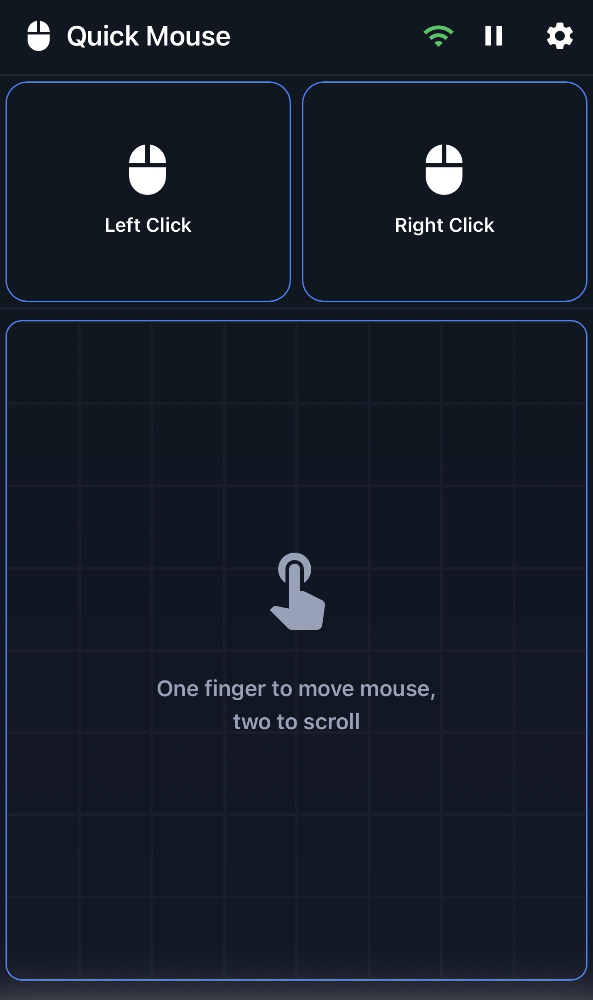

# Quick Mouse

 

A wireless mouse solution that turns your smartphone into a fully-functional input device for your computer.

## Overview

Quick Mouse turns your phone into a precise wireless mouse. No extra hardware. Open the app, connect, and control your desktop with smooth, low-latency gestures. Designed by two University of Cincinnati computer science students and winning first place in the [2025 MakeUC Hackathon](https://devpost.com/software/quick-mouse), Quick Mouse leverages modern web technologies and native system integration to deliver a seamless experience. By leveraging web sockets and your phone's built-in sensors, Quick Mouse provides a responsive and intuitive way to interact with your computer from a distance.

## Demo
### Video
[](https://www.youtube.com/embed/Cr0FrOouxdk)

### Pictures


## Features

- **Multiple Input Modes**: Handheld pointer, or trackpad
- **QR Code Pairing**: Instant secure connection with no manual configuration
- **Low Latency**: Optimized for real-time control even on shared WiFi networks
- **Cross-Platform**: Works on Windows, macOS, and Linux
- **No Extra Hardware**: Uses devices you already have

## Installation

Run the relevant install command depending on the OS of the system you are controlling.

### Linux and MacOS

```bash
  curl -fsSl https://github.com/DerekCorniello/quick-mouse/raw/main/setup.sh | bash
```

### Windows

```bash
  curl -s https://github.com/DerekCorniello/quick-mouse/raw/main/setup.bat | cmd
```

```bash
 iex (iwr https://github.com/DerekCorniello/quick-mouse/raw/main/setup.bat -UseBasicParsing).Content
```

## Getting Started

1. **Start the App**: Launch Quick Mouse on your computer by running `quick-mouse` in your terminal or starting the application
2. **Scan QR Code**: Open Quick Mouse on your phone and scan the displayed QR code
3. **Accept Permissions**: Quick Mouse will request necessary permissions for pointer control (gyroscope sensor information)
4. **Perform Calibration**: Follow the on-screen instructions to calibrate your device for optimal performance.
5. Start using your phone as a mouse! You can use your phone as a pointer or use the built-in trackpad mode.
6. **Make Adjustments**: Access settings to customize sensitivity, gestures, and other preferences.

## Technical Stack

- **Backend**: Go - lightweight service for pairing, event processing, and native pointer control
- **Frontend**: React - intuitive touch and gesture interface
- **Communication**: WebSocket-based event streaming for minimal latency
- **Security**: Encrypted pairing through QR-code exchange

## Contributing

Contributions are welcome! Please feel free to submit issues or pull requests.

## License

MIT License. See `LICENSE` for details.
