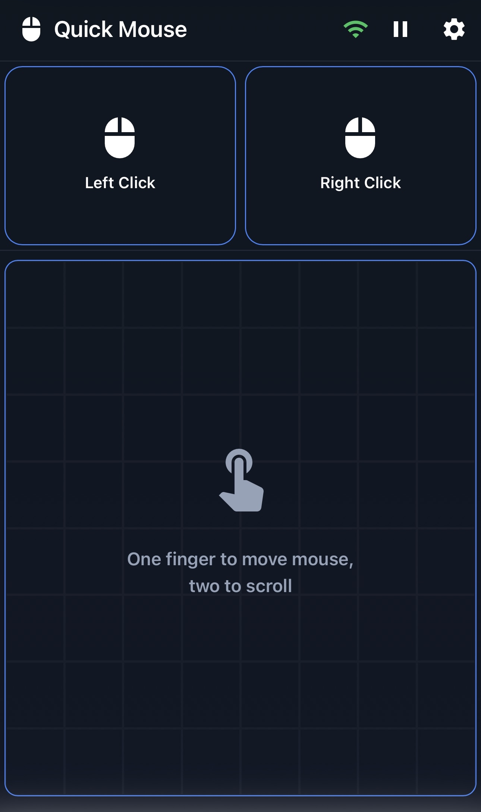

#  Quick Mouse

 

A wireless mouse solution that turns your smartphone into a fully-functional input device for your computer.

## Overview

Quick Mouse turns your phone into a precise wireless mouse. No extra hardware. Open the app, connect, and control your desktop with smooth, low-latency gestures. Designed by two University of Cincinnati computer science students and winning first place in the [2025 MakeUC Hackathon](https://devpost.com/software/quick-mouse), Quick Mouse leverages modern web technologies and native system integration to deliver a seamless experience. By leveraging web sockets and your phone's built-in sensors, Quick Mouse provides a responsive and intuitive way to interact with your computer from a distance.

## Demo
### Video
[](https://www.youtube.com/embed/Cr0FrOouxdk)

### Pictures


## Features

- **Multiple Input Modes**: Handheld pointer, or trackpad
- **QR Code Pairing**: Instant secure connection with no manual configuration
- **Low Latency**: Optimized for real-time control even on shared WiFi networks
- **Cross-Platform**: Works on Windows, macOS, and Linux
- **No Extra Hardware**: Uses devices you already have

## Installation

### Omarchy bar plugin (recommended)

On [Omarchy](https://omarchy.org/) Quick Mouse installs as a shell plugin: a bar
widget that starts the server in the background and shows the pairing QR code.
No terminal needed after setup.

1. Install the prerequisites:

   ```bash
   omarchy pkg add go npm jq
   sudo modprobe uinput
   sudo usermod -aG input "$USER"
   ```

   The `modprobe` takes effect immediately; the group change needs a log out and
   back in (or a reboot). `go`/`npm` are only needed for the first build.

2. Add and enable the plugin:

   ```bash
   omarchy plugin add https://github.com/DerekCorniello/quick-mouse.git --enable
   ```

3. Click the mouse icon in the bar, then scan the QR code with your phone.

   Left click opens the panel and starts the server if it is not running; right
   click stops the server. The first click builds the Go binary and the React
   client in the plugin's own checkout, so it takes a minute; later starts are
   instant.

4. On the phone, accept the self-signed certificate warning (Android:
   **Advanced → Proceed**; iOS: **Show Details → visit this website**), allow
   motion access, and calibrate.

To uninstall: `omarchy plugin remove nathan.quick-mouse`.

### Linux, macOS, and Windows (manual)

Run the relevant install command depending on the OS of the system you are controlling.

#### Linux and MacOS

```bash
curl -fsSL https://raw.githubusercontent.com/DerekCorniello/quick-mouse/main/setup.sh | bash
```

#### Windows (Must be run in PowerShell)

```bash
Invoke-WebRequest -Uri "https://raw.githubusercontent.com/DerekCorniello/quick-mouse/main/setup.bat" -OutFile "$env:TEMP\setup.bat"; & cmd.exe /c "$env:TEMP\setup.bat"
```

## Getting Started

1. **Start the App**: click the Quick Mouse widget in the bar, or run
   `quick-mouse` in a terminal to print the QR code there
2. **Scan QR Code**: scan the displayed QR code with your phone
3. **Accept Permissions**: Quick Mouse will request necessary permissions for pointer control (gyroscope sensor information)
4. **Perform Calibration**: Follow the on-screen instructions to calibrate your device for optimal performance.
5. Start using your phone as a mouse! You can use your phone as a pointer or use the built-in trackpad mode.
6. **Make Adjustments**: Access settings to customize sensitivity, gestures, and other preferences.

## Troubleshooting

- **The phone hangs on a blank page.** The host firewall is dropping the port.
  With `ufw`, allow it: `sudo ufw allow 3000/tcp` (or your configured port).
  Also confirm the phone is on the same network as the computer.
- **"not private" / certificate warning on the phone.** Expected — the server
  uses a self-signed certificate. Tap through it once (Android: **Advanced →
  Proceed**; iOS: **Show Details → visit this website**).
- **`/dev/uinput is not writable`.** Run `sudo modprobe uinput`, add your user
  to the `input` group, then log out and back in.

### Configuration

The plugin/script honors these environment variables when they set sensible
defaults:

- `QM_QUICK_MOUSE_DIR` — where the quick-mouse checkout lives (default: the plugin's own checkout, else `~/repos/quick-mouse`)
- `QM_PORT` — server port (default from `config.json`, else `3000`)
- `QM_STATE_DIR` — runtime state (default `~/.local/state/nathan.quick-mouse`)

### Security and permissions

Plugins run as unsandboxed code inside `omarchy-shell`. This plugin:

- starts a local HTTPS server (`quick-mouse`) that listens on your LAN and
  injects input events through `/dev/uinput`; the QR code embeds a per-start
  auth key
- does **not** use `sudo`; the privileged setup (uinput, `input` group,
  firewall) is performed by you
- builds the Go server and React client from the checkout it ships in

State lives in `~/.local/state/nathan.quick-mouse/` (`server.pid`, `qr.json`,
`server.log`).

## Technical Stack

- **Backend**: Go - lightweight service for pairing, event processing, and native pointer control
- **Frontend**: React - intuitive touch and gesture interface
- **Communication**: WebSocket-based event streaming for minimal latency
- **Security**: Encrypted pairing through QR-code exchange

## Contributing

Contributions are welcome! Please feel free to submit issues or pull requests.

## License

MIT License. See `LICENSE` for details.
